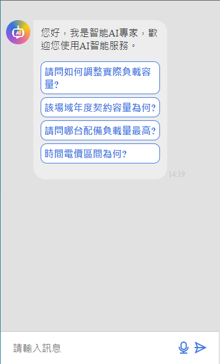

# iems-chatbot-ui-plugin

npm install:  

    npm install iems-chatbot-ui-plugin  

import module:  

    import { createApp } from 'vue';
    import MyPlugin from 'iems-chatbot-ui-plugin';

    const app = createApp(App);
    app.use(MyPlugin);

Use:  

    <chatbotui></chatbotui>

Note:  

在Vue 3应用中使用TypeScript引入自定义插件时，有时会出现找不到声明文件的问题。  
使用插件的Vue 3项目中添加声明文件： 确保你的Vue 3项目中也有一个声明文件（.d.ts）来引用你的插件  

    declare module 'iems-chatbot-ui-plugin';

# Vue Prop:  

prop 包含 `config`, `api`, `msg` 三個屬性， 以及 light, dark 風格
    
    <chatbotui :api="api" :msg="msg" :config="config" class="dark"></chatbotui>
    <drag-ctrl-chat-dialog :api="api" :msg="msg" class="dark"></drag-ctrl-chat-dialog>

    config: {
        name: String,
        showName: Boolean,
        mic: Boolean,
        inputDefaultStr: String,
        addBtn: Boolean,  // dialog header add button
        menuBtn: Boolean  // dialog header menu button
        showHelpBlock: Boolean  // aibot response is helpful or not
    }

    api: {
        root: '', // 根路徑  
        chat: {  
            path: '/iems/chatbot',
            method: 'POST'
            params: {
                resourceId: "984"
            }
        } // chat 接口 api  
    }

    msg: {
        title: 'title', // Dialog header title
        subtitle: String, // Dialog header subtitle
        helloworld: String,
        list: Array String
    }

# UI  

## chatbotui  

使用時，需鑲入 `div` 元件中

## drag-ctrl-chat-dialog  

含開關按鈕的彈窗  

  

  

# api  

## chat (/iEMS/chatbot)  

chat api 格式如下：  

Media type:  

    application/json  

requset body:  

    {
        "messages": [
            {
            "role": "user",
            "content": "Is there any abnormal electric consumption on 8/31?"
            }
        ],
        "params": {
            "resourceId": "984"
        }
    }

	
Response body:  

    {
        "isError": false,
        "messages": [
            {
            "content": "[Expert Data]The energy consumption is normal on 2023-08-31",
            "metadata": {}
            }
        ]
    }
